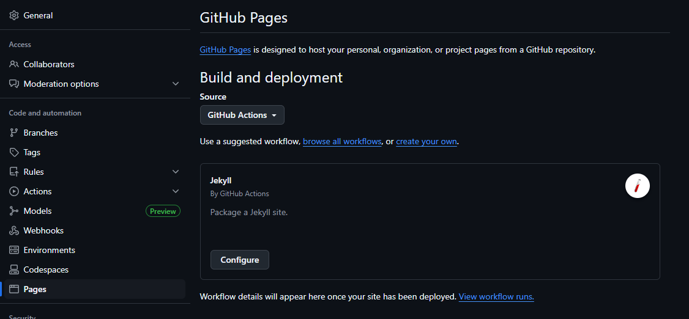
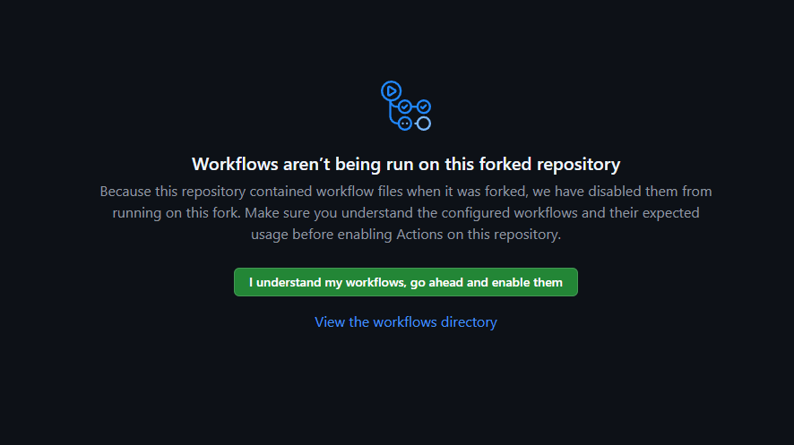
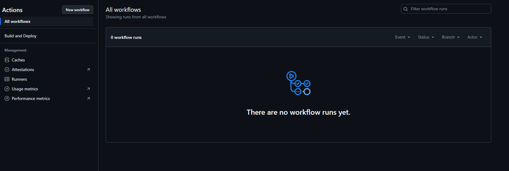
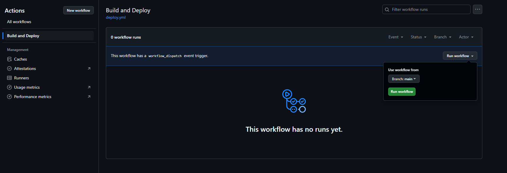
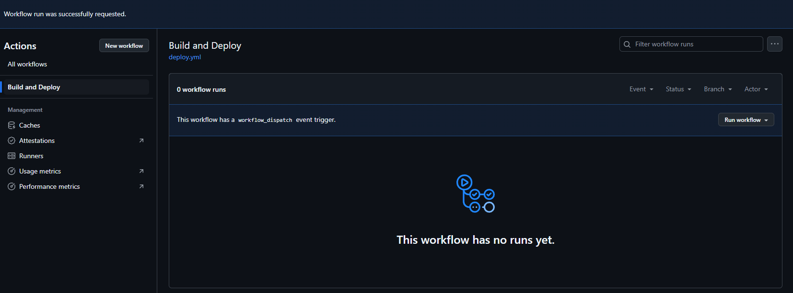

# My Jekyll Portfolio Theme (Catppuccin Styled)
[](https://creativecommons.org/licenses/by/4.0/)

A responsive, multilingual, and easily customizable portfolio theme for Jekyll, styled with Catppuccin themes and Tailwind CSS. It is designed to be adaptable for end-users and flexible for developers.

[View Live Demo](https://sahinmuhammetabdullah.github.io/portfolio-site/)
| [Türkçe Açıklama (Turkish Documentation)](README_tr.md)

## ✨ Key Features

*   **Dynamic Theme Switcher:** Your visitors can switch between Mocha, Latte, Frappé, and Macchiato themes with a single click.
*   **Centralized Configuration:** All personal content (profile, social media, menus, bio, skills) is consolidated into a **single file**: `_data/site_settings.yml`.
*   **Multilingual Support:** Easily manage content in multiple languages using Jekyll Polyglot.
*   **Automatic Deployment:** The site builds and deploys automatically as soon as you push your changes to GitHub, thanks to GitHub Actions.

---

## 🚀 Getting Started

This guide covers the steps needed to both develop the theme on your local machine and deploy it to the web.

### Prerequisites (for Local Development)

*   **Ruby** & **Bundler** & **Jekyll**

### Installation & Local Development

1.  **Clone the Repository:**
    ```bash
    git clone https://github.com/SahinMuhammetAbdullah/portfolio-site.git
    cd portfolio-site
    ```
2.  **Install Dependencies:**
    ```bash
    bundle install
    ```
3.  **Run the Site Locally:**
    ```bash
    bundle exec jekyll serve --livereload --baseurl ""
    ```
    *   Your site will be running at `http://localhost:4000/`. `--livereload` will instantly reflect your changes in the browser.

---

## 🛠️ Customization Guide

You only need to edit the following files to personalize the theme.

### 1. Core Technical Settings (`_config.yml`)

In this file, you'll update basic information like your site's address and title.

*   `title`, `author`, `email`: Fill these in with your own information.
*   `url`: Your site's main URL. It should be **`https://YOUR_USERNAME.github.io`**.
*   `baseurl`: This is very important.
    *   If your repository is named **`YOUR_USERNAME.github.io`**, leave this as **`baseurl: ""`** (empty).
    *   If it has a different name (e.g., `portfolio-site`), change this to **`baseurl: "/YOUR_REPONAME"`** (e.g., `"/portfolio-site"`).

### 2. All Personal Content (`_data/site_settings.yml`)

This is your site's "control panel." You will manage all visible content of the site from this file.

*   **`profile`:** Your name, email, and the path to your `avatar`.
*   **`social_links`:** Your social media links.
*   **`multilingual_content`:** All text content for the site. For each language (`en:`, `tr:`), edit the corresponding `profile` (tagline, bio), `skills`, and `navigation_links` (menu items).

### 3. Projects (`_projects/` folder and File Structure)

You add your projects as `.md` files to the language-specific folders (`tr/`, `en/`) under the `_projects/` directory. The structure of each project file is as follows:

```yaml
---
# --- SETTINGS ARE WRITTEN BETWEEN THESE TWO "---" LINES ---

# UNIQUE PROJECT IDENTIFIER (REQUIRED):
# This ID links versions of the project in different languages.
# It MUST BE THE SAME in the .md file for all languages.
id: my-awesome-project

# ORDER (Optional):
order: 1

# TITLE (Language Specific):
title: "My Awesome Project"

# SHORT DESCRIPTION (Language Specific):
short_description: "A full-featured platform developed with React and Node.js, offering a seamless user experience."

# TAGS:
tags: ["React", "Node.js", "MongoDB"]

# VISUAL SETTINGS:
image_gradient_from: "ctp-blue"
image_gradient_to: "ctp-sapphire"
icon_class: "fas fa-shopping-cart"
cover_image: "/assets/images/projects/my-project-cover.png"

# LINKS:
github_url: "https://github.com/YOUR_USERNAME/project-repo"
live_url: "https://my-project.com"

# --- END OF SETTINGS ---
---

You can write the detailed description of your project here using Markdown.

### Technologies Used
* Item 1
* Item 2


*<center><small> Fig.1 screenshot. </small></center>*
```

## ⚙️ Deploying Your Site

### Method A: With GitHub Pages (Recommended and Easiest)

1.  **Fork** the theme to your own account.
2.  Update the `url` and `baseurl` settings in `_config.yml` for your repository.
3.  In your repository, go to **Settings** > **Pages**.
4.  Under "Build and deployment," select **GitHub Actions** as the **Source**.
5.  Push your changes to the `main` branch. GitHub Actions will start automatically, and your site will be live in a few minutes.

#### Troubleshooting: Automatic Deployment Not Working

If the deployment doesn't start automatically, you can trigger it manually:

1.  **Go to GitHub Pages Settings:**
    *   Navigate to **Settings** > **Pages** and ensure the source is **GitHub Actions**.
    *   Click any link like "View workflow runs".
    

2.  **Enable Workflows:**
    *   If prompted, click the **"I understand my workflows, go ahead and enable them"** button.
    

3.  **Manually Run the Deployment Workflow:**
    *   Go to the **Actions** tab in your repository.
    *   Select your workflow from the left menu.
    
    *   Click the **"Run workflow"** button and confirm by selecting your main branch.
    
    

### Method B: Deploying to Your Own Server

1.  Clone the theme to your computer and follow the local setup steps.
2.  Run `bundle exec jekyll build` in your terminal.
3.  Upload the **contents** of the generated `_site` folder to your server.

## 🙏 Acknowledgements

*   [Jekyll](https://jekyllrb.com/), [Jekyll Polyglot](https://github.com/untra/jekyll-polyglot), [Tailwind CSS](https://tailwindcss.com/), [Font Awesome](https://fontawesome.com/), [Catppuccin Theme Palette](https://github.com/catppuccin/catppuccin)
*   Designed by: **[Muhammet Abdullah Şahin](https://github.com/SahinMuhammetAbdullah)**. This theme is licensed under the [Creative Commons Attribution 4.0 International License](https://creativecommons.org/licenses/by/4.0/). You are free to use, share, and adapt it, provided you give appropriate credit to the original designer.
