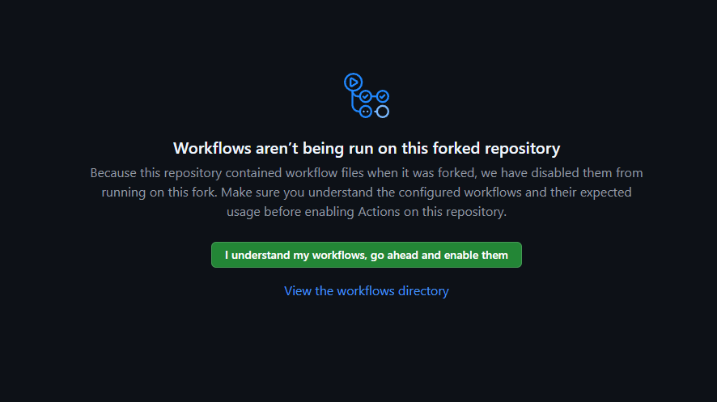

# Jekyll Portfolyo Teması (Catppuccin Stili)

[](https://creativecommons.org/licenses/by/4.0/)

Jekyll için Catppuccin temaları ve Tailwind CSS ile stillendirilmiş, duyarlı, çok dilli ve kolayca kişiselleştirilebilen bir portfolyo temasıdır. Amacı, hem son kullanıcıların kolayca adapte edebileceği hem de geliştiricilerin esnek bulacağı bir yapı sunmaktır.

[Canlı Demoyu Görüntüle](https://sahinmuhammetabdullah.github.io/portfolio-site/)
| [English Documentation (İngilizce Kılavuz)](README.md)

## ✨ Özellikler

*   **Dinamik Tema Değiştirici:** Ziyaretçileriniz Mocha, Latte, Frappé ve Macchiato temaları arasında tek tıkla geçiş yapabilir.
*   **Merkezi Ayar Dosyası:** Sitenin tüm kişisel içeriği (profil, sosyal medya, menüler, biyografi, beceriler) `_data/site_settings.yml` adında **tek bir dosyada** toplanmıştır.
*   **Çoklu Dil Desteği:** Jekyll Polyglot kullanarak içeriği birden çok dilde kolayca yönetin.
*   **Duyarlı Tasarım:** Masaüstü, tablet ve mobil cihazlarda harika görünür.
*   **Tailwind CSS (CDN):** Modern ve hızlı bir stil altyapısı sunar.
*   **Proje Vitrini:** Projelerinizi modal içinde detaylarıyla sergilemek için özel bölüm.
*   **SEO Optimize Edilmiş:** `jekyll-seo-tag`, RSS beslemesi ve site haritası ile.
*   **GitHub Pages Hazır:** Otomatik dağıtım için bir GitHub Actions iş akışı içerir.

---

## 🚀 Başlarken

Bu kılavuz, temayı hem yerel makinenizde geliştirmek hem de internette yayınlamak için gerekli adımları içerir.

### Ön Gereksinimler (Yerel Geliştirme İçin)

*   **Ruby** & **Bundler** & **Jekyll**

### Kurulum ve Yerel Geliştirme

1.  **Depoyu Klonlayın:**
    ```bash
    git clone https://github.com/SahinMuhammetAbdullah/portfolio-site.git
    cd portfolio-site
    ```

2.  **Bağımlılıkları Yükleyin:**
    ```bash
    bundle install
    ```

3.  **Siteyi Yerelde Çalıştırın:**
    ```bash
    bundle exec jekyll serve --livereload --baseurl ""
    ```
    *   Siteniz şimdi `http://localhost:4000/` adresinde çalışıyor olmalıdır. `--livereload` sayesinde yaptığınız değişiklikler anında tarayıcıya yansır.

---

## 🛠️ Özelleştirme Kılavuzu

Temayı kişiselleştirmek için aşağıdaki dosyaları düzenlemeniz yeterlidir.

### 1. Temel Teknik Ayarlar (`_config.yml`)

Bu dosyada sitenizin adresi ve başlığı gibi temel bilgileri güncelleyeceksiniz.

*   `title`, `author`, `email`: Kendi bilgilerinizle doldurun.
*   `url`: Sitenizin yayınlanacağı ana URL. **`https://KULLANICIADINIZ.github.io`** şeklinde olmalıdır.
*   `baseurl`: Bu ayar çok önemlidir.
    *   Eğer deponuzun adı **`KULLANICIADINIZ.github.io`** ise, bu alanı **`baseurl: ""`** (boş) olarak bırakın.
    *   Eğer deponuzun adı farklı bir şeyse (örn: `portfolio-site`), bu alanı **`baseurl: "/DEPOADINIZ"`** (örn: `"/portfolio-site"`) olarak değiştirin.

### 2. Tüm Kişisel İçerik (`_data/site_settings.yml`)

Burası sitenizin "kumanda panelidir". Sitenin tüm görünür içeriğini bu dosyadan yöneteceksiniz.

*   **`profile`:** Adınız, e-postanız ve profil resminizin yolu (`avatar`).
*   **`social_links`:** Kendi sosyal medya linkleriniz.
*   **`multilingual_content`:** Sitenin metinleri. Her dil (`tr:`, `en:`) için ilgili `profile` (slogan, biyografi), `skills` (beceriler) ve `navigation_links` (menü elemanları) metinlerini düzenleyin.

### 3. Projeler (`_projects/` klasörü ve Dosya Yapısı)

Projelerinizi `_projects/` klasörü altındaki dil klasörlerine (`tr/`, `en/`) `.md` dosyaları olarak eklersiniz. Her proje dosyasının yapısı aşağıdaki gibidir:

```yaml
---
# --- AYARLAR BU İKİ "---" SATIRI ARASINA YAZILIR ---

# PROJE KİMLİĞİ (ZORUNLU):
# Bu kimlik, projenin farklı dillerdeki versiyonlarını birbirine bağlar.
# Her dildeki .md dosyasında AYNI OLMALIDIR.
id: benim-harika-projem

# SIRA NUMARASI (İsteğe Bağlı):
order: 1

# BAŞLIK (Dile Özgü):
title: "Harika Projem"

# KISA AÇIKLAMA (Dile Özgü):
short_description: "React ve Node.js ile geliştirdiğim, harika bir kullanıcı deneyimi sunan platform."

# ETİKETLER:
tags: ["React", "Node.js", "MongoDB"]

# GÖRSEL AYARLAR:
image_gradient_from: "ctp-blue"
image_gradient_to: "ctp-sapphire"
icon_class: "fas fa-shopping-cart"
cover_image: "/assets/images/projects/projem-kapak.png"

# LİNKLER:
github_url: "https://github.com/KULLANICIADINIZ/proje-deposu"
live_url: "https://projem.com"

# --- AYARLARIN SONU ---
---

Bu alana projenizin detaylı açıklamasını Markdown formatında yazabilirsiniz.

### Kullandığım Teknolojiler
* Madde 1
* Madde 2


*<center><small> Gör.1 ekran görüntüsü. </small></center>*
```

---

## ⚙️ Sitenizi Yayınlama

### Yöntem A: GitHub Pages ile (Önerilen ve En Kolay)

1.  Temayı kendi hesabınıza **Fork**'layın.
2.  `_config.yml` dosyasında `url` ve `baseurl` ayarlarını kendi deponuza göre güncelleyin.
3.  Deponuzda **Ayarlar (Settings)** > **Sayfalar (Pages)** bölümüne gidin.
4.  "Oluşturma ve dağıtım" başlığı altında, **Kaynak (Source)** olarak **GitHub Actions**'ı seçin.
5.  Yaptığınız değişiklikleri `main` dalına gönderin (`Push`). GitHub Actions otomatik olarak başlayacak ve birkaç dakika içinde siteniz yayında olacaktır.

#### Sorun Giderme: Otomatik Dağıtım Çalışmıyorsa

Eğer dağıtım otomatik başlamazsa, aşağıdaki adımlarla manuel olarak tetikleyebilirsiniz:

1.  **GitHub Pages Ayarlarına Gidin:**
    *   **Ayarlar (Settings)** > **Sayfalar (Pages)** bölümünde kaynağın **GitHub Actions** olduğundan emin olun.
    *   "İş akışı çalıştırmalarını görüntüle" gibi bir link varsa tıklayın.
    

2.  **İş Akışlarını Etkinleştirin:**
    *   Eğer istenirse, **"İş akışlarımı anlıyorum, devam et ve etkinleştir"** butonuna tıklayın.
    

3.  **Dağıtım İş Akışını Manuel Olarak Çalıştırın:**
    *   Deponuzdaki **Eylemler (Actions)** sekmesine gidin.
    *   Sol menüden iş akışınızı seçin.
    
    *   **"İş akışını çalıştır (Run workflow)"** butonuna tıklayın ve ana dalınızı seçerek onaylayın.
    
    

### Yöntem B: Kendi Sunucunuza Yükleme

1.  Temayı bilgisayarınıza klonlayın ve yerel kurulum adımlarını takip edin.
2.  Terminalde `bundle exec jekyll build` komutunu çalıştırın.
3.  Oluşturulan `_site` klasörünün **içindeki tüm dosyaları** kendi sunucunuza yükleyin.

## 🙏 Teşekkürler

*   [Jekyll](https://jekyllrb.com/), [Jekyll Polyglot](https://github.com/untra/jekyll-polyglot), [Tailwind CSS](https://tailwindcss.com/), [Font Awesome](https://fontawesome.com/), [Catppuccin Tema Paleti](https://github.com/catppuccin/catppuccin)
*   Tasarım: **[Muhammet Abdullah Şahin](https://github.com/SahinMuhammetAbdullah)**. Bu tema [Creative Commons Atıf 4.0 Uluslararası Lisansı](https://creativecommons.org/licenses/by/4.0/) altında lisanslanmıştır. Orijinal tasarımcıya atıfta bulunmanız şartıyla temayı kullanmakta, paylaşmakta ve uyarlamakta özgürsünüz.